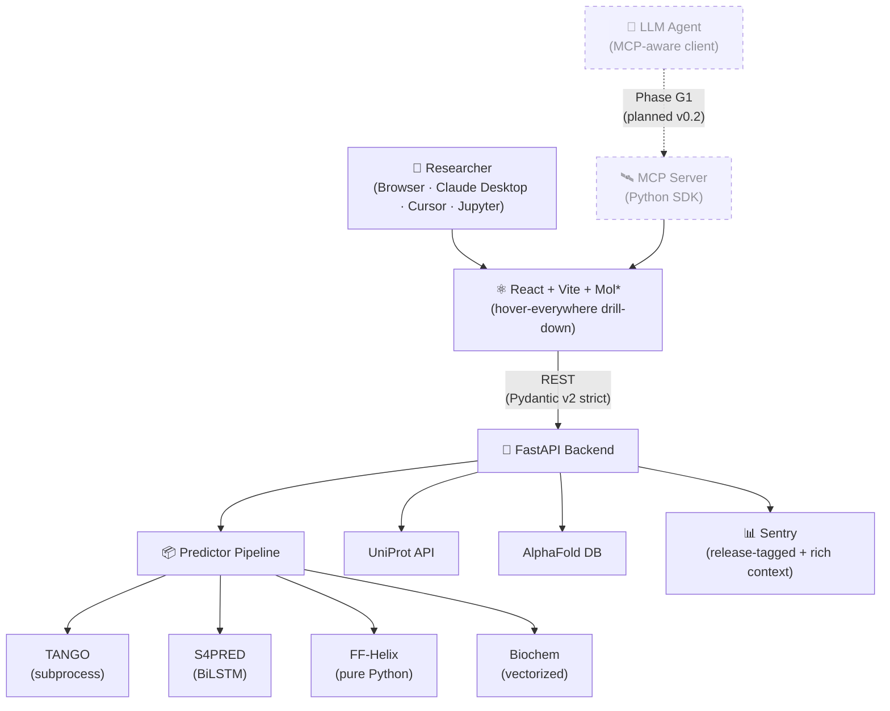
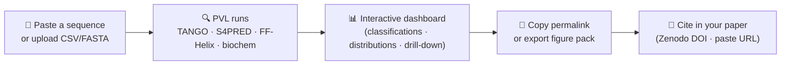

<div align="center">

# Peptide Visual Lab

**Single web tool combining aggregation propensity, secondary structure prediction, and fibril-forming helix detection for peptide researchers.**

Built around [Ragonis-Bachar et al. 2022](https://doi.org/10.1021/acs.biomac.2c00582)'s 4-category classification (Helix · FF-Helix · SSW · FF-SSW). Five surfaces: web · Python package · CLI · MCP server · Docker self-host.

[](https://github.com/saidaz24-meet/peptide_prediction/actions/workflows/ci.yml)
[](https://opensource.org/licenses/MIT)
[](CITATION.cff)
[](#citing-pvl)
[](#status)
[](CONTRIBUTING.md)

[**Live instance**](http://94.130.178.182:3000) · [**Self-host**](#self-host-in-3-minutes) · [**API docs**](#api) · [**Contribute**](CONTRIBUTING.md) · [**Cite**](#citing-pvl)

</div>

---

## Why PVL is different

PVL is the only peptide-prediction tool that puts every analysis in one dashboard, overlays predictions on the AlphaFold structure, and turns each analysis into a citable URL. The competition is single-algorithm CLI tools that emit static PNGs.

| What you get | How others handle it |
|---|---|
| 🧬 **Multi-tool consensus** — TANGO + S4PRED + FF-Helix + biochem + AlphaFold + UniProt in one place | Switch tabs across 5 sites; merge CSVs in Excel |
| 🔬 **Live 3D structure overlay** — TANGO peaks + S4PRED helix segments + FF-Helix candidates + SSW zones rendered ON the AlphaFold structure via Mol\* | Read coords from a flat file; manually paint residues in PyMOL |
| 🔗 **Reproducibility-as-permalink** — every analysis becomes a URL with version + SHA + thresholds. Paste it in a paper; reviewers see the same view | Screenshot for the supplement; pray it stays accurate |
| 🤖 **AI-platform-ready** — designed for MCP, Python package, CLI, and embeddable widget | Web-only, no API, no integration story |
| 🆓 **Open source · MIT · runs on your laptop** — `docker compose up` and your data never leaves your machine | Closed-source, paid, or hosted-only |

---

## Screenshots

<table>
  <tr>
    <td width="50%">
      <strong>Quick Analyze</strong> — paste a single sequence, see results in seconds.
      <br/>
      
    </td>
    <td width="50%">
      <strong>Results Overview</strong> — classification landscape, click any region to filter.
      <br/>
      
    </td>
  </tr>
  <tr>
    <td width="50%">
      <strong>Smart Candidate Ranking</strong> — adjustable metric weights + presets.
      <br/>
      
    </td>
    <td width="50%">
      <strong>2D Backbone</strong> — color-coded residues from AlphaFold PDB.
      <br/>
      
    </td>
  </tr>
  <tr>
    <td colspan="2" width="100%">
      <strong>Correlation Matrix</strong> — pairwise Pearson correlations with rotated headers + diverging palette.
      <br/>
      
    </td>
  </tr>
</table>

---

## Architecture



Architectural decisions logged in [`docs/active/DECISIONS.md`](docs/active/DECISIONS.md). Internal platform vision in [`docs/internal/TECH_PLATFORM_VISION.md`](docs/internal/TECH_PLATFORM_VISION.md).

---

## Self-host in 3 minutes

```bash
git clone https://github.com/saidaz24-meet/peptide_prediction.git
cd peptide_prediction
cp backend/.env.example backend/.env
make docker-up
```

Open <http://localhost:3000>. Done. Your data never leaves your machine.

### Optional prediction tools

| Tool | Purpose | Required? | Where |
|------|---------|-----------|-------|
| **S4PRED** | Secondary structure (helix / beta / coil) | Optional | `tools/s4pred/models/` (5 model files) |
| **TANGO** | Aggregation propensity | Optional | `tools/tango/bin/tango` |
| **FF-Helix** | Fibril-forming helix detection | Always available | Built-in (pure Python) |

Without S4PRED or TANGO, PVL still computes FF-Helix %, charge, hydrophobicity, μH, biochem properties, and the full classification pipeline.

---

## Use PVL from Claude Desktop

PVL exposes an MCP server so any MCP-aware LLM client (Claude Desktop, Cursor, Continue, Cline, Windsurf) can call PVL natively — paste a UniProt accession, ask for amyloid candidates, and get back a structured analysis with a permalink you can cite.

### Setup (Claude Desktop)

1. Install `pvl-mcp`. Until the PyPI release ships, install from source:

   ```bash
   # from a clone of this repo
   cd mcp_server && pip install -e .
   # (post-PyPI: pip install pvl-mcp)
   ```

2. Add to your Claude Desktop config (`~/Library/Application Support/Claude/claude_desktop_config.json` on macOS, `%APPDATA%\Claude\claude_desktop_config.json` on Windows):

   ```json
   {
     "mcpServers": {
       "pvl": {
         "command": "python",
         "args": ["-m", "pvl_mcp"],
         "env": { "PVL_API_URL": "http://localhost:8000" }
       }
     }
   }
   ```

   Point `PVL_API_URL` at your own PVL backend (a hosted instance, your VPS, or a local `uvicorn api.main:app --port 8000`).

3. Restart Claude Desktop. Try these prompts:

   > "Use PVL to look up its version."
   >
   > "Use PVL to analyze the sequence GIGAVLKVLTTGLPALISWIKRKRQQ and tell me whether it is FF-Helix."
   >
   > "Use PVL to search UniProt for amyloid peptides from S. aureus, length 10–50, then rank the top 5 by FF-Helix score."

The MCP server exposes the same prediction pipeline used by the web UI — every result comes back with PVL's exact category definitions (Helix / FF-Helix / SSW / FF-SSW) so the LLM can't hallucinate a Chou-Fasman propensity or confuse aggregation with fibril formation.

See [`docs/active/MCP_RUNBOOK.md`](docs/active/MCP_RUNBOOK.md) for full configuration, the tool reference, Cursor / Continue setup, and troubleshooting.

---

## Tech stack

<table>
  <tr>
    <td><strong>Frontend</strong></td>
    <td>React 18 · TypeScript 5 · Vite · Tailwind · shadcn/ui · Zustand · Recharts · <a href="https://molstar.org/">Mol*</a></td>
  </tr>
  <tr>
    <td><strong>Backend</strong></td>
    <td>Python 3.11 · FastAPI · Pydantic v2 · pandas · PyTorch (CPU)</td>
  </tr>
  <tr>
    <td><strong>Predictors</strong></td>
    <td>TANGO (Linux 64-bit subprocess) · S4PRED (5-model BiLSTM ensemble) · FF-Helix (pure Python) · biochem (vectorized)</td>
  </tr>
  <tr>
    <td><strong>Observability</strong></td>
    <td>Sentry (release-tagged + rich context + source maps + Slack alerts + Seer AI triage)</td>
  </tr>
  <tr>
    <td><strong>CI/CD</strong></td>
    <td>GitHub Actions · CodeRabbit (AI PR review) · Dependabot (weekly batched)</td>
  </tr>
  <tr>
    <td><strong>Deployment</strong></td>
    <td>Docker Compose + Caddy (auto-TLS) · DESY Kubernetes (planned)</td>
  </tr>
  <tr>
    <td><strong>Reproducibility</strong></td>
    <td>Permalink-encoded analysis state · Zenodo DOI per release · CITATION.cff</td>
  </tr>
</table>

---

## How it works



---

## Use cases

- **Identify amyloid candidates** in a UniProt query (e.g., S. aureus reference proteome length 10-50)
- **Compare wild-type vs mutant** peptide cohorts side-by-side with overlay distributions
- **Generate a paper figure pack** — multi-panel SVG ready for a Nature supplement
- **Automate analysis from Claude Desktop** (Phase G1, MCP server in v0.2)
- **Find peptides similar to a reference** via vector embedding search (Phase 2 v0.2)

---

## API

FastAPI auto-generates OpenAPI documentation at runtime. Once the backend is running:

- Interactive docs: <http://localhost:8000/api/docs>
- OpenAPI JSON: <http://localhost:8000/api/openapi.json>
- ReDoc view: <http://localhost:8000/api/redoc>

Selected endpoints (full list in [`docs/active/CONTRACTS.md`](docs/active/CONTRACTS.md)):

| Endpoint | Method | Description |
|---|---|---|
| `/api/predict` | POST | Single sequence prediction |
| `/api/upload` | POST | Batch CSV / FASTA / XLSX upload |
| `/api/uniprot/execute` | POST | UniProt query → analysis pipeline |
| `/api/jobs/{id}` | GET | Poll async job status |
| `/api/version` | GET | Build version + SHA + timestamp |
| `/api/health` | GET | Health check (Sentry cron monitor) |

All request schemas use Pydantic v2 with `extra="forbid"` — unknown fields fail loudly with 422 (per [ADR-002](docs/active/DECISIONS.md#adr-002--pydantic-v2-extraforbid-on-request-schemas)).

---

## Documentation

The doc tree splits into three buckets per the project's [clean-push policy](docs/internal/CLEAN_PUSH_POLICY_2026_06_07.md): **active** (publishable architecture + scientific reference), **internal** (process docs kept in repo for the why-trail), and **archive** (frozen historical artifacts).

### Architecture + scientific reference (`docs/active/`)

| Document | What it covers |
|---|---|
| [`ACTIVE_CONTEXT.md`](docs/active/ACTIVE_CONTEXT.md) | Architecture overview · entry points · data flow |
| [`MASTER_DEV_DOC.md`](docs/active/MASTER_DEV_DOC.md) | Consolidated architecture + decisions reference |
| [`DEVELOPER_REFERENCE.md`](docs/active/DEVELOPER_REFERENCE.md) | Pipeline internals · null semantics · debugging |
| [`CONTRACTS.md`](docs/active/CONTRACTS.md) | API endpoints · request/response shapes |
| [`DECISIONS.md`](docs/active/DECISIONS.md) | Architectural decision records (ADRs) |
| [`ROADMAP.md`](docs/active/ROADMAP.md) | Phases A–L plus O / S — every planned feature with effort estimates |
| [`KNOWN_ISSUES.md`](docs/active/KNOWN_ISSUES.md) | Honest known-bug list |
| [`TESTING_GUIDE.md`](docs/active/TESTING_GUIDE.md) | Test patterns · golden fixtures · debugging |
| [`DEPLOYMENT.md`](docs/active/DEPLOYMENT.md) | VM + Docker + Caddy step-by-step |
| [`CHANGELOG_PELEG.md`](docs/active/CHANGELOG_PELEG.md) | Scientific changelog reviewed by Peleg Ragonis-Bachar |
| [`SPECIALS.md`](docs/active/SPECIALS.md) | Special handling rules (Aβ42 etc.) |
| [`SENTRY_RUNBOOK.md`](docs/active/SENTRY_RUNBOOK.md) | Observability ops · alert rules · error fingerprints |
| [`MCP_RUNBOOK.md`](docs/active/MCP_RUNBOOK.md) | MCP server install + usage |
| [`MOL3D_OVERLAY_SPEC.md`](docs/active/MOL3D_OVERLAY_SPEC.md) | Mol* 3D overlay technical spec |
| [`UNIPROT_ENRICHMENT_SPEC.md`](docs/active/UNIPROT_ENRICHMENT_SPEC.md) | UniProt integration spec |
| [`VECTOR_SEARCH_SPEC.md`](docs/active/VECTOR_SEARCH_SPEC.md) | LanceDB + ESM-2 vector search architecture |
| [`ECOSYSTEM_GUIDE.md`](docs/active/ECOSYSTEM_GUIDE.md) | 5-surface reference (web · Python · CLI · MCP · self-host) |
| [`DESIGN_SYSTEM.md`](docs/active/DESIGN_SYSTEM.md) | Tailwind + shadcn conventions |
| [`A4_BIO_TOOLS_SUBMISSION.md`](docs/active/A4_BIO_TOOLS_SUBMISSION.md) | bio.tools submission packet |
| [`A5_ZENODO_RELEASE.md`](docs/active/A5_ZENODO_RELEASE.md) | Zenodo release procedure |
| [`CONTRIBUTING.md`](CONTRIBUTING.md) | How to contribute · what to expect from a part-time-maintained project |

---

## Running tests

```bash
make test          # Backend (pytest) — 463 deterministic, no-network tests
cd ui && npx vitest run   # Frontend (vitest) — 424 component tests
make lint          # Linters (ruff + ESLint)
make typecheck     # Type checks (mypy + tsc)
make ci            # Full pipeline
```

**Total: 887 tests, all green.** Tests are deterministic and run without network access.

---

## Project structure

```
peptide_prediction/
├── backend/                  # FastAPI Python backend
│   ├── api/routes/           # Route definitions
│   ├── services/             # Business logic
│   ├── schemas/              # Pydantic v2 models (extra="forbid")
│   ├── auxiliary.py          # FF-Helix + 4-category classification
│   ├── tango.py · s4pred.py  # External predictor wrappers
│   └── tests/                # 463 pytest tests
├── ui/                       # React + TypeScript frontend
│   ├── src/components/       # ~120 components incl. Mol3DViewer, SetDiagram
│   ├── src/components/drilldown/  # Universal drill-down system
│   ├── src/components/hover/      # Universal hover system
│   ├── src/lib/              # metricRegistry, permalink, sentryContext
│   ├── src/stores/           # Zustand: dataset, threshold, hover, drilldown
│   └── src/pages/            # Index, Results, PeptideDetail, QuickAnalyze
├── pvl-cli/                  # `pvl analyze` CLI (scaffolded — Wave 2)
├── pvl-py/                   # `import pvl` Python package (scaffolded — Wave 2)
├── docker/                   # Multi-stage Dockerfiles + 4 compose files
├── docs/active/              # Living documentation (24 docs)
└── docs/images/              # README screenshots
```

---

## Status

PVL is currently **v0.3.0 pre-release**. The pipeline implements [Dr. Peleg Ragonis-Bachar](https://orcid.org/0000-0002-0979-8165)'s 4-category classification algorithm from [Ragonis-Bachar et al. 2022](https://doi.org/10.1021/acs.biomac.2c00582) (*Biomacromolecules*). Her monthly scientific review is in progress; the Zenodo DOI mints on release tag.

---

## Citing PVL

If you use PVL in your research, please cite both the **software** and the **underlying algorithm**:

### Software

```bibtex
@software{pvl_2026,
  author    = {Ragonis-Bachar, Peleg and Azaizah, Said and Golubev, Aleksandr and Landau, Meytal},
  title     = {Peptide Visual Lab (PVL)},
  version   = {0.3.0},
  year      = {2026},
  url       = {https://github.com/saidaz24-meet/peptide_prediction},
  doi       = {10.5281/zenodo.PENDING},
  license   = {MIT}
}
```

### Underlying algorithm

```bibtex
@article{ragonis_bachar_2022,
  author  = {Ragonis-Bachar, Peleg and Rayan, Bader and Barnea, Eilon and Engelberg, Yizhaq and Upcher, Alexander and Landau, Meytal},
  title   = {Natural Antimicrobial Peptides Self-assemble as α-Sheet Conformations as Defined by a Linear Motif},
  journal = {Biomacromolecules},
  year    = {2022},
  volume  = {24},
  pages   = {413--425},
  doi     = {10.1021/acs.biomac.2c00582}
}
```

The Zenodo DOI is auto-assigned on each GitHub release; the badge above updates once v0.3.0 ships.

PVL also exposes a per-analysis citation hook: every analysis URL is copyable + citable via the in-app **Reproducibility Ribbon**. Paste a permalink in your paper to give readers the exact same view you analyzed.

See [`CITATION.cff`](CITATION.cff) for machine-readable citation metadata.

---

## Authors

Author order on the software citation reflects scientific contribution. The corresponding author for the published paper will be Prof. Meytal Landau.

<table>
  <tr>
    <td><strong>Algorithms + scientific lead</strong></td>
    <td>
      <a href="https://orcid.org/0000-0002-0979-8165">Dr. Peleg Ragonis-Bachar</a> · Technion (Department of Biology)
      <br/>
      <em>4-category classification, threshold definitions, scientific review, validation cohort.</em>
    </td>
  </tr>
  <tr>
    <td><strong>Software + platform</strong></td>
    <td>
      <a href="https://orcid.org/0009-0002-3596-5358">Said Azaizah</a>
      · MIT (incoming) + DESY
      <br/>
      <em>Lead developer — backend, frontend, ecosystem (5-surface), CI/CD, observability, deployment.</em>
    </td>
  </tr>
  <tr>
    <td><strong>Scientific advisor</strong></td>
    <td>
      <strong>Dr. Aleksandr Golubev</strong> · DESY + Technion
      <br/>
      <em>Research direction, lab adoption, infrastructure.</em>
    </td>
  </tr>
  <tr>
    <td><strong>Corresponding author</strong></td>
    <td>
      <a href="https://orcid.org/0000-0002-1743-3430">Prof. Meytal Landau</a> · Technion + EMBL Hamburg + Centre for Structural Systems Biology
      <br/>
      <em>Lab PI, structural biology direction, paper correspondence.</em>
    </td>
  </tr>
</table>

---

## Acknowledgements

PVL stands on the shoulders of these tools and groups. Cite them where appropriate.

- **[Ragonis-Bachar et al. 2022](https://doi.org/10.1021/acs.biomac.2c00582)** — the 4-category classification (Helix · FF-Helix · SSW · FF-SSW) implemented in this tool. *Biomacromolecules* 24, 413–425.
- **[TANGO](https://tango.switchlab.org/)** — Fernandez-Escamilla et al., *Nat Biotechnol* 22, 1302–1306 (2004)
- **[S4PRED](https://github.com/psipred/s4pred)** — Moffat et al., *Bioinformatics* 38, 4647–4653 (2022)
- **[Mol\*](https://molstar.org/)** — RCSB PDB + EBI + ETH consortium
- **[AlphaFold DB](https://alphafold.ebi.ac.uk/)** — Jumper et al. (2021); Varadi et al. (2024)
- **DESY / CSSB** — Prof. Meytal Landau lab; Dr. Aleksandr Golubev

---

## License

[MIT](LICENSE). Maintained part-time by Said with support from Peleg and Alex. See [`CONTRIBUTING.md`](CONTRIBUTING.md) for what part-time means in practice (TL;DR: 1–4 week response times during academic terms; bigger releases batched in summer breaks).
